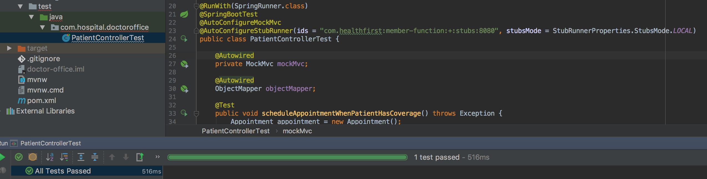

## Microserivce - Doctor's Office - Consuming Application
### Main dependencies
The important dependencies are 
```
<dependency>
	<groupId>org.springframework.boot</groupId>
	<artifactId>spring-boot-starter-web</artifactId>
</dependency>
```
To call the Health Insurance Check service we can use either RestTemplate or Feign. This example uses Feign.
```
<dependency>
	<groupId>org.springframework.cloud</groupId>
	<artifactId>spring-cloud-starter-openfeign</artifactId>
</dependency>
```
Contract stub runner to run the stub shared by Health Insurance Check service.
```
<dependency>
	<groupId>org.springframework.cloud</groupId>
	<artifactId>spring-cloud-starter-contract-stub-runner</artifactId>
</dependency>
```
Member-Function Stub dependency listed just to grab the stubs.jar from maven repository by limiting the scope to just test.
```
<dependency>
	<groupId>com.healthfirst</groupId>
	<artifactId>member-function</artifactId>
	<classifier>stubs</classifier>
	<version>0.0.1-SNAPSHOT</version>
	<scope>test</scope>
	<exclusions>
		<exclusion>
			<groupId>*</groupId>
			<artifactId>*</artifactId>
		</exclusion>
	</exclusions>
</dependency>
```
### Code Explaination
Feigin client to call the Health Insurance check Function serive.


@FeignClient(name = "HealthFirstService",
    url = "http://localhost:8080", fallback = HealthFirstService.HealthFirstServiceFallback.class)
public interface HealthFirstService {

    @RequestMapping(method = RequestMethod.POST, path = "/members")
    @Headers("Accept:application/json;charset=UTF-8")
    HealthFirstMember verifyCoverage(@RequestBody HealthFirstMember member);

    @Component
    class HealthFirstServiceFallback implements HealthFirstService {
        @Override
        public HealthFirstMember verifyCoverage(@RequestBody HealthFirstMember member) {
            member.setCoverage(HealthFirstMember.Coverage.NONE);
            return member;
        }
    }
}


### Contract
Following annotation runs the member-function stub at localhost port 8080.


@AutoConfigureStubRunner(ids = "com.healthfirst:member-function:+:stubs:8080", stubsMode = StubRunnerProperties.StubsMode.LOCAL)


### Run Testcase
Now the test case passes covering end-to-end testing.
- Calling the appointment REST controller First

```
MockHttpServletRequest:
      HTTP Method = POST
      Request URI = /api/v1/appointments
       Parameters = {}
          Headers = {Content-Type=[application/json;charset=UTF-8], Accept=[application/json;charset=UTF-8]}
             Body = {"firstName":"Madhu","lastName":"Sambangi","memberId":"123456789","dateOfBirth":"01/01/2018"}
    Session Attrs = {}

Handler:
             Type = com.hospital.doctoroffice.PatientController
           Method = public com.hospital.doctoroffice.AppointmentResponse com.hospital.doctoroffice.PatientController.appointments(com.hospital.doctoroffice.Appointment)
```

- Which calls the Feign client for member's coverage.

```
127.0.0.1 - POST /members

User-Agent: [Java/1.8.0_131]
Connection: [keep-alive]
Host: [localhost:8080]
Accept: [*/*]
Content-Length: [40]
Content-Type: [application/json;charset=UTF-8]
{"memberId":"123456789","coverage":null}
```

- Feign client calls the stubbed Health Insurance check service and gets the member's coverage as per the contract.

```
Matched response definition:
{
  "status" : 200,
  "body" : "{\"memberId\":\"123456789\",\"coverage\":\"MEDICAL\"}",
  "headers" : {
    "Content-Type" : "application/json;charset=UTF-8"
  }
}
```

- controller checks the coverage and returns CONFIRMED if the coverage is MEDICAL.

```
MockHttpServletResponse:
           Status = 200
    Error message = null
          Headers = {Content-Type=[application/json;charset=UTF-8]}
     Content type = application/json;charset=UTF-8
             Body = {"status":"CONFIRMED"}
    Forwarded URL = null
   Redirected URL = null
          Cookies = []
```

- Finally, the test case passes if the appointment status is CONFIRMED.

